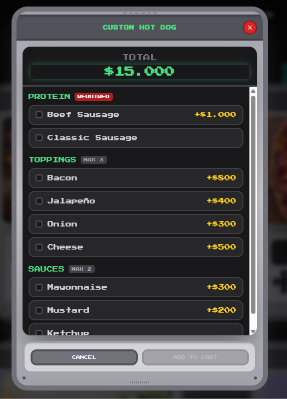
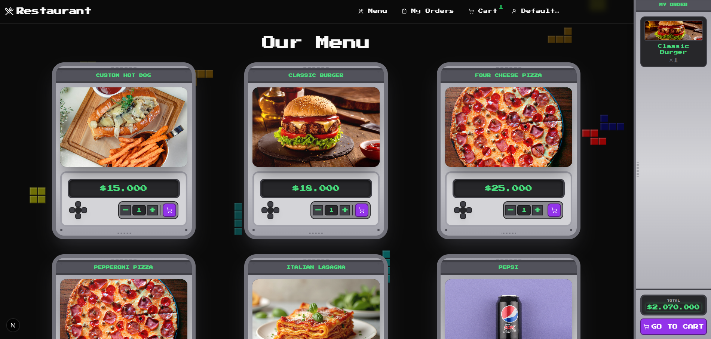
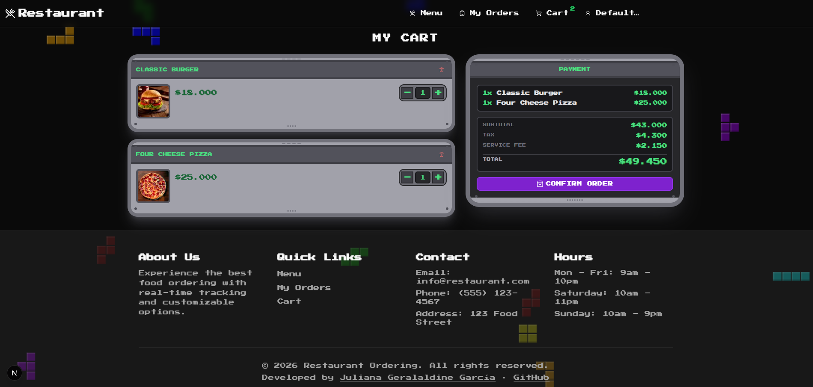

# Restaurant Ordering Workspace

Restaurant ordering platform composed of two applications that run together locally:

- A backend API built with Serverless Framework and DynamoDB Local
- A frontend built with Next.js for menu browsing, cart management, checkout, order history, and event timeline visualization

This repository is the workspace container for both projects. The backend and frontend still keep their own dedicated README files for implementation-specific details, while this root README acts as the main entry point for setup, architecture overview, and navigation.

## 📑 Table of Contents

- [Screenshots](#-screenshots)
- [Documentation Strategy](#-documentation-strategy)
- [Repository Structure](#-repository-structure)
- [Project Components](#-project-components)
  - [Backend](#backend)
  - [Frontend](#frontend)
- [Architecture Overview](#-architecture-overview)
  - [Frontend Architecture](#frontend-architecture)
  - [Backend Architecture](#backend-architecture)
- [Development Model](#-development-model)
- [Prerequisites](#-prerequisites)
- [Environment Setup](#-environment-setup)
  - [Backend](#backend-1)
  - [Frontend](#frontend-1)
- [Ports](#-ports)
- [Installation](#-installation)
- [Local Run Flow](#-local-run-flow)
- [Root Scripts](#-root-scripts)
- [Main API Endpoints](#-main-api-endpoints)
- [Seed Data](#-seed-data)
- [Mock Users](#-mock-users)
- [Money Representation](#-money-representation)
- [Postman Collection](#-postman-collection)
- [Recommended Reading Order](#-recommended-reading-order)
- [Additional Notes](#-additional-notes)


## 🖼️ Screenshots

<table>
<tr>
<td rowspan="2" width="50%">

<strong>Aditionals</strong><br>


</td>

<td width="50%">

<strong>Menu</strong><br>


</td>
</tr>

<tr>
<td>

<strong>Cart</strong><br>


</td>
</tr>
</table>
---

## 📘 Documentation Strategy

This workspace follows a documentation structure that is common and practical for multi-application projects:

- Root README: system overview, how to run everything together, shared conventions, architecture summary, and navigation.
- Backend README: API-specific details, local infrastructure, backend architecture, and backend-focused troubleshooting.
- Frontend README: UI-specific behavior, environment variables, route overview, and frontend-focused troubleshooting.

This is generally the best balance for projects like this. Keeping only a short general README is usually not enough, but moving everything into one giant root document also becomes hard to maintain. The recommended approach is:

- Keep the root README as the entry point and project map
- Keep deep technical details close to each application
- Cross-link the three documents clearly so evaluators or collaborators know where to go next

---

## 🗂️ Repository Structure

```text
restaurant_ordering/
|-- restaurant_ordering_backend/
|-- restaurant_ordering_front/
|-- scripts/
|-- package.json
`-- README.md
```

---

## 🧩 Project Components

### Backend

Path: [`restaurant_ordering_backend`](C:/Users/Bruja/Documents/Proyectos/restaurant_ordering/restaurant_ordering_backend)

Responsibilities:

- Expose the REST API
- Manage cart mutations
- Create and retrieve orders
- Store order timeline events
- Support idempotent checkout
- Persist data in DynamoDB Local during local development

See the backend README for full backend documentation:

- [`restaurant_ordering_backend/README.md`](C:/Users/Bruja/Documents/Proyectos/restaurant_ordering/restaurant_ordering_backend/README.md)

### Frontend

Path: [`restaurant_ordering_front`](C:/Users/Bruja/Documents/Proyectos/restaurant_ordering/restaurant_ordering_front)

Responsibilities:

- Render the menu
- Allow product customization
- Manage the cart flow
- Trigger checkout
- Display order history
- Display timeline events for each order

See the frontend README for full frontend documentation:

- [`restaurant_ordering_front/README.md`](C:/Users/Bruja/Documents/Proyectos/restaurant_ordering/restaurant_ordering_front/README.md)

---

## 🏗️ Architecture Overview

The system is intentionally split into two applications connected over HTTP.

### Frontend Architecture

The frontend uses a feature-oriented structure:

```text
src/
|-- app/       # Next.js routes and layout
|-- features/  # Business features: menu, cart, orders
`-- shared/    # Reusable UI, config, hooks, stores and utilities
```

### Backend Architecture

The backend follows a layered structure inspired by Clean Architecture:

```text
src/
|-- domain/          # Entities, value objects, repository contracts
|-- application/     # Use cases and application services
|-- infrastructure/  # DynamoDB and repository implementations
`-- interfaces/      # HTTP handlers, mappers and request validation
```

---

## 👤 Development Model

### No Real Authentication

This project does not implement login, registration, sessions, or user management.

To keep the flow simple for local development and evaluation, the application uses a fixed development user identifier:

```env
NEXT_PUBLIC_USER_ID=user-test
```

Important notes:

- There is no real user module in the system
- The frontend simulates a current user using `NEXT_PUBLIC_USER_ID`
- Cart and order requests are associated with that fixed identifier
- Order history is filtered using that same fixed identifier
- The Postman collection included in this workspace also uses the same development user by default

---

## ✅ Prerequisites

| Tool | Recommended Version | Purpose |
|---|---|---|
| Node.js | 18.x LTS | Frontend and backend runtime |
| npm | 9+ | Package manager |
| Docker Desktop | Latest | DynamoDB Local |
| AWS CLI | v2.x | `aws --version` |

---

## ⚙️ Environment Setup

### Backend

Copy the example file:

```bash
# Windows
copy restaurant_ordering_backend\.env.example restaurant_ordering_backend\.env

# macOS / Linux
cp restaurant_ordering_backend/.env.example restaurant_ordering_backend/.env
```

Main values for local development:

```env
AWS_REGION=us-east-1
AWS_ACCESS_KEY_ID=dummy
AWS_SECRET_ACCESS_KEY=dummy
DYNAMODB_ENDPOINT=http://localhost:8000
TABLE_ORDERS=orders
TABLE_TIMELINE=order_timeline
TABLE_MENU=menu
TABLE_IDEMPOTENCY=idempotency
```

### Frontend

Copy the example file:

```bash
# Windows
copy restaurant_ordering_front\.env.example restaurant_ordering_front\.env.local

# macOS / Linux
cp restaurant_ordering_front/.env.example restaurant_ordering_front/.env.local
```

Required local values:

```env
NEXT_PUBLIC_API_URL=http://localhost:3000
NEXT_PUBLIC_DEFAULT_USER_ENABLED=true
NEXT_PUBLIC_USER_ID=user-test
NEXT_PUBLIC_DEFAULT_USERNAME=default.user
NEXT_PUBLIC_DEFAULT_NAME=Default User
NEXT_PUBLIC_DEFAULT_EMAIL=default.user@example.com
NEXT_PUBLIC_DEFAULT_PHONE=+57 300 111 2233
```

---

## 🔌 Ports

| Service | Port |
|---|---:|
| Backend API | `3000` |
| Frontend | `3001` |
| DynamoDB Local | `8000` |

---

## 📦 Installation

Install both applications from the workspace root:

```bash
npm run install:all
```

---

## 🚀 Local Run Flow

Recommended order:

1. Install dependencies.
2. Create environment files.
3. Start DynamoDB Local.
4. Initialize tables and seed menu data.
5. Start backend and frontend.

### One-command workflow from the root

```bash
npm run install:all
npm run docker:up
npm run init:db
npm run dev
```

This starts:

- Backend at `http://localhost:3000`
- Frontend at `http://localhost:3001`

### Separate terminals

Terminal 1:

```bash
npm run docker:up
npm run init:db
npm run dev:backend
```

Terminal 2:

```bash
npm run dev:frontend
```

---

## 🛠️ Root Scripts

```bash
npm run install:backend
npm run install:frontend
npm run install:all
npm run dev:backend
npm run dev:frontend
npm run dev
npm run docker:up
npm run docker:down
npm run docker:logs
npm run init:db
npm run setup:backend
npm run test:backend
npm run test:frontend
npm run test
```

---

## 🌐 Main API Endpoints

| Method | Endpoint | Description |
|---|---|---|
| `GET` | `/menu` | Retrieve menu products |
| `POST` | `/cart/items` | Add item to cart |
| `PUT` | `/cart/items` | Update a specific cart item |
| `DELETE` | `/cart/items` | Remove a cart item or all items by product |
| `POST` | `/orders` | Submit checkout asynchronously |
| `GET` | `/orders` | List orders filtered by `userId` |
| `GET` | `/orders/:orderId` | Retrieve order details |
| `GET` | `/orders/:orderId/timeline` | Retrieve paginated order timeline events |
| `POST` | `/users/session` | Create or recover a mock user |
| `GET` | `/users/:userId` | Retrieve a mock user profile |

---

## 🍽️ Seed Data

After `npm run init:db`, the local menu includes 10 products:

- `1`: Classic Burger
- `2`: Double Cheese Burger
- `3`: Pepperoni Pizza
- `4`: Four Cheese Pizza
- `5`: Italian Lasagna
- `6`: Coca-Cola
- `7`: Pepsi
- `8`: Custom Burger
- `9`: Custom Hot Dog
- `10`: Custom Tacos

Products `8`, `9`, and `10` include modifiers.

---

## 👥 Mock Users

The project supports simulated users persisted by the backend.

- If `NEXT_PUBLIC_DEFAULT_USER_ENABLED=true`, the frontend boots with the configured default mock user already active.
- If `NEXT_PUBLIC_DEFAULT_USER_ENABLED=false`, the app starts signed out.
- From the user panel, a reviewer can create or recover a mock user by `username + name + email + phone`.
- Orders remain linked by `userId`, so changing the active user changes the visible order history.

---

## 💰 Money Representation

All monetary values in API payloads and persistence are stored as integer minor units.

- For COP, this means centavos.
- Example: `1800000` represents `COP 18,000.00`.
- The frontend formats these minor units back into human-readable COP values.

---

## 📬 Postman Collection

A ready-to-run Postman collection is included here:

- [`restaurant_ordering_backend/postman/restaurant-ordering.postman_collection.json`](C:/Users/Bruja/Documents/Proyectos/restaurant_ordering/restaurant_ordering_backend/postman/restaurant-ordering.postman_collection.json)

The collection is designed for local execution and includes:

- Menu retrieval
- Add item to cart
- Add customized item
- Get order by id
- Update cart item
- Remove item
- Remove all instances of a product
- List orders by user
- Place order with idempotency
- Read order timeline
- Failure cases for validation and conflict scenarios

It uses collection variables to chain requests automatically, including:

- `baseUrl`
- `userId`
- `orderId`
- `cartItemId`
- `productId`
- `customProductId`
- `idempotencyKey`
- `nextToken`

---

## 🧭 Recommended Reading Order

For evaluators, reviewers, or collaborators:

1. Read this root README first.
2. Read the backend README for API and infrastructure details.
3. Read the frontend README for UI and route details.
4. Use the Postman collection to exercise the backend flow end to end.

---

## 📝 Additional Notes

- The workspace is intentionally organized as two applications, not as a single merged app.
- The current setup is suitable for local development, demonstrations, and technical evaluation.
- The fixed user flow is intentional and documented; it is not a bug or an incomplete login implementation.

---

